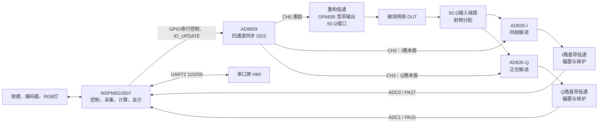
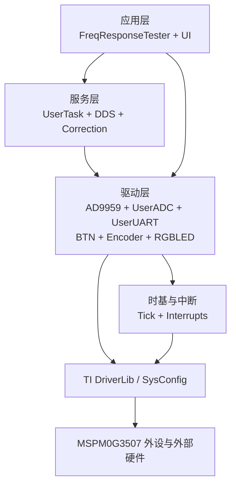
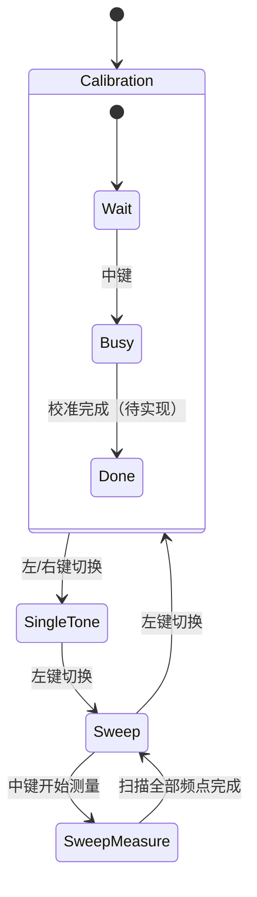
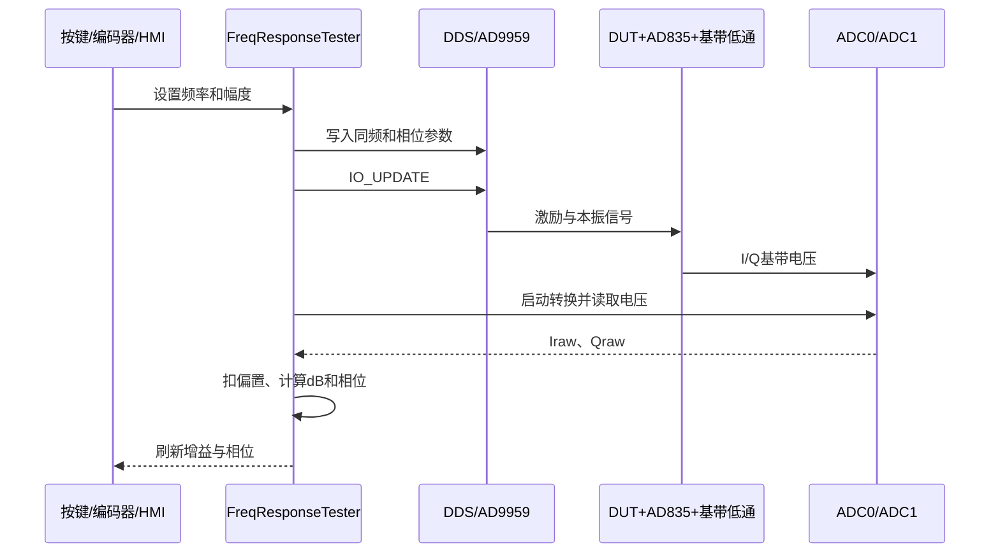

# 2013 E题简易频率特性测试仪——软硬件总体设计

本文档以学长提供的 `FrequencyResponseTester_v3` 参考工程为软件基础，合并此前的题目分析、联网调研和 `AD9959 + AD835 + MSPM0G3507` 初步设计，作为后续硬件制作、软件完善和整机联调的统一说明。

文中使用以下状态：

- **已实现**：当前参考代码中已经存在，并完成 MSPM0G3507 编译、链接验证。
- **已有框架**：数据结构或接口已经存在，但算法、参数或联调尚未完成。
- **后续设计**：属于完整仪器目标，当前代码还没有实现。

## 1. 项目目标与方案结论

题目要求仪器在约 `1 MHz～40 MHz` 范围内产生扫频信号，并测量被测网络的幅频和相频特性。软件默认参数与题目相匹配：

| 项目 | 当前默认值或目标 |
|---|---:|
| 起始频率 | 1 MHz |
| 终止频率 | 40 MHz |
| 频率步进 | 100 kHz |
| 扫频点数 | 391 点 |
| 连续扫频时间 | 2 s |
| 单频输出幅度设置 | 1.0 Vpp |
| 标记频率 | 20 MHz |
| 测量目标 | 增益、相位、中心频率、-3 dB 带宽 |

最终整机采用下面的技术路线：

> MSPM0G3507 控制 AD9959 产生激励和正交本振；被测网络输出送入两片 AD835 做零中频正交解调；I/Q 基带经过低通、偏置和保护后由 MSPM0G3507 的两路 ADC 采集；软件完成校准、幅相计算、扫频曲线和串口屏显示。

选择该方案的原因：

1. AD9959 有四个同步 DDS 通道，频率、相位和幅度可以独立设置，适合同时产生激励、I 本振和 Q 本振。
2. 两片 AD835 直接完成同频正交乘法，MSPM0G3507 只采低速基带，不需要直接采样 40 MHz 射频。
3. MSPM0G3507 具备两路 ADC、足够的 Flash/SRAM、定时器和串口资源，适合承担控制、采集、计算与界面任务。
4. 当前仓库已经有可编译的 AD9959 驱动、扫频状态机、ADC、按键、编码器和 HMI 框架，后续可以在学长代码上逐步补齐功能。

## 2. 整机总体架构



整机可以按功能拆为五块：

1. **数字控制板**：番茄派 MSPM0G3507，运行状态机并控制全部外设。
2. **DDS 信号源板**：AD9959、25 MHz 参考时钟、PLL、DAC输出和控制接口。
3. **射频输出链路**：重构滤波、OPA695 放大、50 Ω源端匹配和 SMA 接口。
4. **正交解调板**：射频端接、两片 AD835、I/Q 本振输入、基带低通与电平转换。
5. **人机交互部分**：串口屏、五向按键、旋转编码器和 RGB 状态灯。

## 3. 测量原理

设被测网络的频率响应为：

```text
H(jω) = |H(ω)| · exp(jφ)
```

激励信号、I 路本振和 Q 路本振分别为：

```text
vS = AS cos(ωt)
vI = AL cos(ωt)
vQ = -AL sin(ωt)
```

被测网络输出为：

```text
vO = AS |H| cos(ωt + φ)
```

将 `vO` 分别与 `vI`、`vQ` 相乘，并滤除两倍频分量后，可以得到：

```text
I = K · AS · AL · |H| · cos(φ) / 2
Q = K · AS · AL · |H| · sin(φ) / 2
```

因此：

```text
幅度 ∝ sqrt(I² + Q²)
相位 = atan2(Q, I)
```

当前参考代码已经使用 `sqrtf()`、`log10f()` 和 `atan2f()` 计算结果：

```text
Gain_dB = 20 log10(sqrt(I² + Q²)) + gainOffset[f]
Phase   = atan2(Q, I) × 180/π + phaseOffset[f]
```

使用 `atan2(Q,I)` 而不是 `atan(Q/I)`，可以正确识别四个象限，并避免 `I≈0` 时直接相除。

## 4. 硬件架构详细设计

### 4.1 AD9959 与参考时钟

当前驱动按以下时钟关系配置 AD9959：

```text
外部参考时钟：25 MHz
AD9959 PLL倍频：20倍
系统时钟：500 MHz
频率控制字：FTW = fout × 2³² / 500 MHz
```

500 MHz 系统时钟下，32 位频率控制字的理论分辨率约为 `0.116 Hz`；14 位相位字的理论分辨率约为 `0.022°`，均远小于题目所需的 100 kHz 步进和 5°相位精度。

控制接口采用软件模拟串行时序：

- `SCLK`：串行时钟；
- `SDIO0`：串行数据；
- `CS`：片选；
- `IO_UPDATE`：让多个通道的新参数同时生效；
- `RESET`：硬件复位。

`IO_UPDATE` 是保证正交关系的关键。各通道的频率、幅度和相位应先全部写入寄存器，再统一触发更新，不能逐通道立即生效。

### 4.2 DDS 通道规划

完整双 AD835 硬件建议按下表分配：

| AD9959通道 | 目标相位 | 完整硬件用途 |
|---|---:|---|
| CH0 | 0° | 被测网络的激励信号，经重构滤波和 OPA695 后输出 |
| CH1 | 可编程 | 参考监测、校准或备用输出 |
| CH2 | 0° | AD835-I 的同相本振 |
| CH3 | ±90° | AD835-Q 的正交本振 |

当前学长代码只操作 `CH0` 和 `CH1`，设置为同频、相差 90°的两路输出。这适合学长原有的两输入正交解调模块，但与“CH0 激励 + CH2/CH3 双 AD835 本振”的完整硬件分配并不完全一致。

因此后续接入自制双 AD835 板时，需要调整 DDS 通道映射；当前阶段只记录设计，不修改学长业务流程。

### 4.3 重构滤波与 OPA695 输出

AD9959 DAC 输出不能直接视为理想正弦源。输出端仍包含采样镜像、时钟泄漏以及随频率变化的幅度包络，因此每个射频通道都需要重构低通。

建议做法：

- 通带覆盖 `1 MHz～40 MHz`；
- 截止频率初步选择 `60 MHz～80 MHz`，最终通过仿真和实测确定；
- 激励、I 本振、Q 本振采用相同滤波拓扑、同批次器件和对称布局；
- 滤波器前后均预留 0 Ω、串联电阻和并联电容位置，便于现场修正；
- 射频走线按 50 Ω控制阻抗处理。

CH0 激励链路使用 OPA695 或同等级宽带运放完成放大和隔离：

```text
AD9959 CH0 → 重构低通 → OPA695 → 50 Ω源端匹配 → SMA输出
```

输出级必须在外接 50 Ω负载时仍能达到题目要求的幅度。不能只测量空载电压，因为串联源端电阻与 50 Ω负载会形成分压。

### 4.4 DUT 接口与 50 Ω端接

射频接口采用 SMA 和短同轴线，不使用杜邦线传输 40 MHz信号。

关键原则：

1. 仪器输出端具有约 50 Ω源阻抗。
2. 被测网络输出进入仪器后，只放置一个精密 `49.9 Ω`终端。
3. 端接后的节点再对称分配给两片 AD835 的高阻输入。
4. 不能给两片 AD835 各放一个 50 Ω终端，否则并联后会变成 25 Ω，直接改变被测网络的增益和有载 Q。
5. 两条分配支路尽量短、等长，可各串 `22～33 Ω`小电阻用于隔离输入电容。

推荐接口顺序：

```text
DUT输出SMA → ESD/保护选配位 → 隔直电容 → 49.9 Ω端接
           → 对称分支 → AD835-I X输入
                      → AD835-Q X输入
```

### 4.5 双 AD835 正交解调

两片 AD835 构成完全对称的 I/Q 单元：

- 两片的 X 输入都接 DUT 输出；
- I 路 Y 输入接 0°本振；
- Q 路 Y 输入接 ±90°本振；
- X2、Y2 按选定的单端转差分方式连接；
- W 输出送入基带低通；
- Z 输入可用于输出偏置，也可以在后级运放完成电平平移。

AD835 建议使用低噪声 `±5 V`模拟电源。两片器件应镜像放置，X、Y、W 三类走线保持同环境，电源去耦至少在每片器件附近配置 `100 nF + 4.7 µF`。

AD9959 模块本振幅度需要实测。初始调试可以从较低幅度开始，确认 AD835 在线性区工作后再提高；若直接驱动幅度不足，应使用对称的宽带缓冲级，不能只给某一路加放大导致 I/Q 不一致。

### 4.6 基带低通、偏置和 ADC 保护

AD835 输出包含期望的直流/低频分量和约 `2f` 的高频乘积项。每一路需要低通滤波：

```text
AD835 W → 二阶低通 → 电平平移 → ADC隔离RC → MSPM0 ADC
```

低通截止频率不应照搬极低的 1 Hz设计。1 Hz滤波虽然噪声低，但建立时间会使 391 点扫频远超 30 s。建议：

- 初始截止频率约 `100 Hz`；
- 可调范围约 `50 Hz～300 Hz`；
- 每个频点先等待滤波器稳定，再丢弃过渡样本并进行多次平均；
- 通过整机实测在噪声、过冲和扫频速度之间折中。

MSPM0 ADC 只能接受非负电压，因此 I/Q 基带必须平移到 ADC量程中部。当前代码默认扣除 `1.67 V` 的低通输出偏置，硬件初版可把静态中心设计在约 `1.65～1.67 V`，并在上电后重新测量真实零点。

ADC 输入还应具备：

- 小阻值串联电阻，隔离采样保持瞬态；
- 对地小电容，抑制高频残留；
- 钳位或限流保护，确保输入不超出 MCU 电源轨；
- 足够低的驱动源阻抗，保证采样电容建立。

### 4.7 电源、时钟与接地

建议按功能划分电源域：

| 电源域 | 主要负载 | 设计要点 |
|---|---|---|
| 3.3 V数字 | MSPM0、数字接口、HMI逻辑 | 与模拟电源之间使用磁珠/滤波隔离 |
| AD9959电源 | DDS数字核、模拟核、DAC | 按模块或数据手册要求分路去耦 |
| +5 VA | OPA695、AD835正电源 | 低噪声、局部大容量去耦 |
| -5 VA | AD835及双电源运放负电源 | 关注开关纹波和启动顺序 |
| 参考/偏置 | ADC基带中心电压 | 低噪声、可校准、避免被数字负载调制 |

MSPM0 当前 SysConfig 还使用 `PA6` 输入 40 MHz外部高频时钟；AD9959 使用独立的 25 MHz参考时钟。两者不是同一时钟节点，布线和文档中不能混淆。

PCB 不建议简单割裂模拟地和数字地，而应使用连续地平面，通过器件摆放与回流路径控制噪声：

- DDS时钟、SCLK、IO_UPDATE 远离 AD835 W 输出和 ADC输入；
- 射频链路保持连续参考平面；
- 开关电源远离射频输入、基带低通和参考电压；
- SMA外壳、屏蔽罩和机壳地连接方式在整机阶段统一处理。

### 4.8 MSPM0G3507 引脚分配

以下引脚来自当前 `FrequencyResponseTester.syscfg`：

| 功能 | MSPM0G3507引脚 | 当前用途 |
|---|---|---|
| HFCLK输入 | PA6 | 40 MHz外部高频时钟 |
| DDS_RESET | PA7 | AD9959复位 |
| DDS_SCLK | PA8 | AD9959串行时钟 |
| DDS_SDIO0 | PA9 | AD9959串行数据 |
| DDS_UPDATE | PB2 | AD9959同步更新 |
| DDS_CS | PB3 | AD9959片选 |
| ADC0 | PA27 | I路基带采样 |
| ADC1 | PA15 | Q路基带采样 |
| UART0 TX/RX | PA10 / PA11 | 调试串口，115200 bit/s |
| UART2 TX/RX | PB17 / PB18 | 串口屏，115200 bit/s |
| 按键 LEFT/DOWN/RIGHT/UP/MID | PB6/PB7/PB8/PB9/PB14 | 五向按键，内部上拉 |
| 编码器 A/B/SW | PB15/PB16/PA12 | A相中断、B相判向、按压输入 |
| RGB灯 R/G/B | PA3/PA2/PA4 | TIMG7/TIMG8 PWM |
| SWDIO/SWCLK | PA19/PA20 | 下载与调试 |

## 5. 软件总体架构

当前软件采用简单的裸机轮询加中断计时结构，没有引入 RTOS。



### 5.1 启动与主循环

程序入口非常清晰：

```text
main
 ├─ SYSCFG_DL_init()       初始化时钟、GPIO、ADC、UART、PWM、SysTick
 ├─ UserTask_init()
 │   ├─ UI_init()
 │   └─ FRT_init()
 └─ while (1)
     └─ UserTask_loop()
         ├─ UI_taskBTN()   处理五向按键
         ├─ UI_taskENC()   处理旋转编码器
         ├─ UI_taskShow()  刷新串口屏
         └─ FRT_task()     执行测量状态机
```

这种结构适合当前参考工程，优点是调用关系直观；缺点是 `Tick_delay()` 和 ADC等待都属于阻塞式操作，后续提高扫频速度时需要控制阻塞时间。

### 5.2 软件模块职责

| 模块 | 主要职责 | 当前状态 |
|---|---|---|
| `FrequencyResponseTester.c` | 系统初始化和永久主循环 | 已实现 |
| `UserTask` | 统一调度 UI 与频响任务 | 已实现 |
| `FreqResponseTester` | 校准、单频、扫频、扫频测量状态机 | 已有框架，校准未完成 |
| `FRT_Types` | 工作模式、扫频参数、结果和校准数组 | 已实现 |
| `DDS` | 对 AD9959 驱动进行点频和扫频封装 | 已实现 |
| `AD9959` | GPIO模拟串行时序、寄存器、频率/幅度/相位设置 | 已实现 |
| `UserADC` | ADC0/ADC1启动、超时等待和电压换算 | 已实现，尚未使用DMA平均 |
| `Correction` | 线性修正 `y=kx+b` | 基础接口已实现 |
| `UI` | 页面切换、参数编辑、曲线和标记刷新 | 已实现框架 |
| `BTN` | 五向按键读取与消抖 | 已实现 |
| `Encoder` | 旋转增量和按压读取 | 已实现 |
| `UserUART` | UART0调试和UART2 HMI发送 | 已实现 |
| `Tick` | 1 ms系统计时和软件任务节拍 | 已实现 |
| `Interrupts` | SysTick、ADC和GPIO中断入口 | 已实现 |
| `RGBLED` | 三色灯PWM控制 | 已实现驱动 |

### 5.3 频率特性测试状态机



四种主模式：

1. `FRT_MODE_CALIBRATION`：显示校准页面并管理等待、进行中、完成状态；当前校准算法仍是 TODO。
2. `FRT_MODE_SINGLE_TONE`：约每 200 ms更新一次 DDS，采集一次 I/Q并计算单频增益和相位。
3. `FRT_MODE_SWEEP`：按设定起点、终点、步进和总时间连续更新 DDS，用于输出扫频和浏览界面。
4. `FRT_MODE_SWEEP_MEASURE`：逐点更新 DDS、采样并写入曲线数组，完成后返回扫频页面。

### 5.4 数据结构

`FRT_Param_t` 保存运行参数：

- 单频频率与 Vpp；
- 扫频起点、终点、步进、总时间、点数和当前位置；
- 校准状态；
- 基带偏置 `LPFOffset`；
- 逐频点 `gainOffset[]` 和 `phaseOffset[]`。

`FRT_Data_t` 保存测量结果：

- 单频增益和相位；
- 扫频数组；
- 当前标记点数据；
- 中心频率和 -3 dB带宽。

当前扫频数据缓冲区长度为 401，默认 1 MHz～40 MHz、100 kHz步进实际使用 391 个频点，保留了少量余量。

### 5.5 DDS 软件分层

```text
FreqResponseTester
    ↓ 频率、幅度、相位与扫描参数
DDS.c
    ↓ 点频/扫频统一接口
AD9959.c
    ↓ GPIO模拟串行写寄存器
AD9959硬件
```

`DDS_singleTone()` 只写参数，不立即生效；调用者最后执行 `DDS_update()`，用一个 `IO_UPDATE` 同步更新相关通道。

当前扫频由 MCU 每到一个时间间隔修改一次频率，而不是完全依赖 AD9959 内部自动扫频。这便于软件在每个频点插入等待、采样和校准步骤。

### 5.6 ADC 与中断

当前 ADC 工作流程：

```text
启动 ADC0、ADC1转换
    ↓
ADC中断保存 MEM0 结果并置 DataValid
    ↓
主循环等待有效标志，超时返回0
    ↓
ADC码值换算为电压
    ↓
减去 LPFOffset 得到有符号 I/Q
```

当前代码是两路分别启动、每个频点各读取一次，不是严格同步采样，也没有 DMA 和多次平均。对于低速基带，早期联调可以工作；要稳定达到幅相精度，后续应改为：

1. 同一个定时器事件触发 ADC0、ADC1；
2. DMA采集 64～256 组 I/Q；
3. 丢弃换频后的过渡样本；
4. 对剩余数据做均值、异常值检查和超时处理。

### 5.7 UI 与串口屏

UART2 以 115200 bit/s连接 HMI。当前 UI 支持：

- 校准、单频、扫频页面切换；
- 单频频率和幅度编辑；
- 扫频起点、终点、步进、幅度和时间编辑；
- 参数位选择与闪烁提示；
- 扫频曲线、光标位置、增益和相位显示；
- 校准状态文本显示。

UART0 保留为调试串口。HMI 工程和光标图片位于：

```text
resources/display/FrequencyResponseTester_v2.HMI
resources/display/Marker16x30/
```

## 6. 单频与扫频数据流

### 6.1 单频测量



### 6.2 连续扫频输出

默认 391 点在 2 s内完成，每点时间约为：

```text
2000 ms / 391 ≈ 5.12 ms
```

这一模式主要验证扫频源，不要求每个频点都完成高精度测量。

### 6.3 测量扫频

完整测量模式建议每个频点执行：

| 阶段 | 建议预算 |
|---|---:|
| 写DDS寄存器并同步更新 | < 1 ms |
| 等待基带低通稳定 | 8～15 ms |
| 丢弃过渡样本 | 1～2 ms |
| ADC同步采样与平均 | 8～12 ms |
| 校准、幅相计算和存储 | 2～4 ms |
| 调度余量 | 3～6 ms |

按每点约 30 ms计算，391 点约需 11.7 s，加上界面刷新仍有余量满足 30 s目标。

当前参考代码换频后只延时 1 ms并读取一次 ADC，该流程适合验证程序链路，但不是最终精度方案。

## 7. 校准体系

校准是达到幅度和相位指标的核心，不能只靠理论器件参数。

### 7.1 当前代码预留的简单校准

当前数据结构已经为每个频点预留：

```text
LPFOffset
gainOffset[401]
phaseOffset[401]
```

最小可用方案：

1. 关闭DDS或断开射频，测量 I/Q静态偏置，更新 `LPFOffset`或分别保存 I/Q偏置。
2. 使用 50 Ω直通连接，逐频点测量增益和相位。
3. 把理想直通值与实测值之差写入 `gainOffset[]`、`phaseOffset[]`。
4. DUT测量时按频点查表修正。

当前 `FRT_MODE_CALIBRATION` 中仍保留 TODO，校准数组尚未自动生成和保存。

### 7.2 推荐的复数校准

更稳健的方案是每个频点保存直通复数：

```text
ZTHRU(f) = Ithru(f) + jQthru(f)
ZDUT(f)  = Idut(f)  + jQdut(f)
Hcorrected(f) = ZDUT(f) / ZTHRU(f)
```

这样可以同时消除：

- DDS和放大器的幅度起伏；
- 固定电缆与PCB延时；
- I/Q通道增益不一致；
- AD835比例因子；
- 大部分固定相位偏差。

若需要进一步修正正交角误差，可增加 0°和90°两组校准，在每个频点建立 2×2矩阵：

```text
[Imeas - bI]   [m11 m12] [Re(H)]
[Qmeas - bQ] = [m21 m22] [Im(H)]
```

运行时使用矩阵逆变换恢复真实复数响应。该方案精度高，但需要新增校准数据结构、Flash存储和矩阵运算，属于后续软件设计。

### 7.3 为什么要逐频点校准

40 MHz时，1 ns路径延时对应约 14.4°相移。若只在一个频点校准，其他频点仍会因为线缆、滤波器和PCB路径延时产生明显相位误差。

因此校准表必须覆盖整个扫频范围，或者至少保存足够密集的频率锚点并插值。每次更换电缆、解调板或输出链路后，都应重新校准。

## 8. RLC 被测网络与结果提取

题目典型网络中心频率约为 20 MHz、有载 Q约为4，则理论带宽：

```text
BW = f0 / Q = 20 MHz / 4 = 5 MHz
```

若采用 `C = 18 pF`，理论电感约为：

```text
L = 1 / ((2πf0)² C) ≈ 3.52 µH
```

实际器件必须关注电感的自谐振频率、20 MHz处Q值和等效串联电阻，不能只按标称电感值选型。电容优先使用 C0G/NP0。

软件从扫频数组提取参数的建议流程：

1. 查找最大增益点，得到中心频率 `f0`。
2. 计算峰值以下 3 dB的目标电平。
3. 从峰值向左右搜索两个交点，并在线性插值得到 `fL`、`fH`。
4. 计算 `BW = fH - fL`。
5. 计算 `Q = f0 / BW`。

当前 `FRT_Data_t` 已有 `centerF` 和 `bandwidth` 字段，但自动提取算法尚未在参考代码中完成。

## 9. 当前实现边界

为避免把设计目标误认为现成功能，当前状态汇总如下：

| 能力 | 当前状态 | 后续工作 |
|---|---|---|
| MSPM0G3507 CCS工程 | 已实现并可编译链接 | 保持SDK和SysConfig版本一致 |
| AD9959基础驱动 | 已实现 | 上板验证各频点幅相 |
| 两通道同步点频 | 已实现 | 双AD835硬件需扩展为三通道映射 |
| 1～40 MHz、100 kHz软件扫频 | 已有实现 | 测量实际扫频时间和换频稳定性 |
| ADC0/ADC1单次采样 | 已实现 | 增加同步触发、DMA和平均 |
| I/Q幅相计算 | 已实现 | 加入异常值和低幅度保护 |
| 按键、编码器、HMI | 已有完整框架 | 与实物页面逐项联调 |
| 逐频点增益/相位数组 | 已预留 | 实现校准生成、插值与Flash保存 |
| 复数或2×2矩阵校准 | 未实现 | 后续设计 |
| 中心频率、带宽、Q值提取 | 仅有数据字段 | 后续设计 |
| 双AD835模拟前端 | 设计阶段 | 原理图、仿真、PCB和实测 |
| 过压、超时、断线诊断 | 部分超时框架 | 增加错误状态和UI提示 |

## 10. 联调顺序

建议坚持分模块闭环，避免一次性连接整机后难以定位问题。

### 阶段A：数字与DDS

1. 验证 MSPM0 80 MHz运行和1 ms SysTick。
2. 示波器检查 SCLK、SDIO0、CS、RESET、IO_UPDATE。
3. 验证 AD9959 在 1 MHz、20 MHz、40 MHz输出正确。
4. 验证两通道同频和90°相位差。
5. 验证100 kHz步进和2 s连续扫频。

### 阶段B：单路AD835

1. 只安装 I 路乘法器和低通。
2. 输入同频同相信号，确认得到稳定直流。
3. 改变相位为0°、90°、180°，验证余弦关系。
4. 测量无射频时的输出偏置和温漂。

### 阶段C：双路I/Q

1. 增加 Q 路并检查两路布局、增益和偏置一致性。
2. 验证 `atan2(Q,I)` 能正确覆盖四象限。
3. 对已知相移和衰减器做点频误差统计。
4. 再决定是否加入本振缓冲或可切换基带增益。

### 阶段D：采集与校准

1. 从单次ADC读取升级为定时器同步触发。
2. 加入DMA、多次平均和过渡样本丢弃。
3. 完成零偏、直通和逐频点校准。
4. 测试更换频点后的最佳等待时间。

### 阶段E：扫频与显示

1. 完成391点测量和曲线显示。
2. 完成标记点、峰值、中心频率和-3 dB带宽。
3. 与示波器、信号源或网络分析仪逐点对比。
4. 最后处理温漂、重复装配和长时间运行问题。

## 11. 误差来源与风险控制

| 误差来源 | 可能结果 | 主要措施 |
|---|---|---|
| 参考时钟误差 | 全频段频率偏差 | 使用低ppm时钟并实测校准 |
| DDS通道相位差 | I/Q不正交 | 同步IO_UPDATE、对称链路、逐频点校准 |
| 射频路径延时差 | 高频相位误差迅速增大 | 等长布局、固定线缆、复数直通校准 |
| OPA695与滤波器起伏 | 幅频曲线不平坦 | 仿真、实测和逐频点幅度修正 |
| AD835零偏和温漂 | 小信号时相位跳动 | 上电测零、温度稳定后复校 |
| 基带低通过慢 | 扫频超时 | 截止频率与每点等待时间联合设计 |
| ADC不同步或噪声 | I/Q矢量抖动 | 同步触发、DMA平均、良好参考与驱动 |
| 50 Ω端接错误 | 增益和Q值整体错误 | 明确源阻抗、负载和唯一端接点 |
| 信号过小 | `log10(0)`或相位无意义 | 设置幅度门限并显示无效点 |
| HMI阻塞发送 | 扫频节拍被拖慢 | 扫频时降低刷新率或改为缓冲发送 |

最重要的工程避坑：

1. MSPM0 ADC不能直接测量40 MHz射频，只采AD835解调后的低速基带。
2. 不能使用两个50 Ω并联端接同一个DUT输出。
3. 不能只校准单一频点。
4. 不能只用一次ADC采样作为最终测量值。
5. 不能让串口屏每个频点大量刷新，显示应与测量解耦。
6. 不能在尚未验证单路AD835前直接制作全集成板。

## 12. 工程目录、编译与资源

```text
2013-E题-简易频率特性测试仪-番茄派工程/
├─ README.md                         本文档
├─ 代码/
│  └─ FrequencyResponseTester/
│     ├─ .project
│     ├─ .cproject
│     ├─ .ccsproject
│     ├─ FrequencyResponseTester.c  主程序
│     ├─ FrequencyResponseTester.syscfg
│     ├─ targetConfigs/
│     │  └─ MSPM0G3507.ccxml
│     └─ User/                       学长参考代码模块
└─ resources/
   └─ display/
      ├─ FrequencyResponseTester_v2.HMI
      └─ Marker16x30/
```

CCS 编译步骤：

1. 导入已有 CCS工程目录 `代码/FrequencyResponseTester`。
2. 确认目标器件为 `MSPM0G3507`。
3. 确认 MSPM0 SDK为 `2.10.00.04`。
4. 运行一次 SysConfig，检查生成宏为 `__MSPM0G3507__`。
5. 执行 **Project → Clean**。
6. 执行 **Build Project**。

当前工程已完成全部16个源文件的编译和链接验证。仍存在少量未使用变量、未使用参数以及 `switch` 未覆盖全部枚举值的警告，但不影响生成 `.out` 文件。

仓库不保存 `Debug/`、`.out`、`.map`、CCS启动记录、个人编辑器配置和SysConfig临时产物。

## 13. 与学长原始工程的关系

当前代码以学长 `FrequencyResponseTester_v3` 为主体，只做了必要的工程兼容处理：

1. 目标器件固定为 MSPM0G3507。
2. SysConfig适配 MSPM0 SDK 2.10.00.04。
3. 主文件和SysConfig文件名与当前工程名统一。
4. 修正 `showCalibrationVal()` 参数不一致。
5. 修正 `UI_taskBTN()` 调用缺少参数。

除此之外，没有用此前独立框架替换学长的业务代码。本文档中的完整硬件、DMA采样、复数校准和参数提取属于后续设计，不代表当前源码已经实现。

## 14. 参考资料

1. [2013 E题官方题目](https://nuedc.org/problems/2013_E%E9%A2%98_%E7%AE%80%E6%98%93%E9%A2%91%E7%8E%87%E7%89%B9%E6%80%A7%E6%B5%8B%E8%AF%95%E4%BB%AA.pdf)
2. [AD9959产品与数据资料](https://www.analog.com/en/products/ad9959.html)
3. [EVAL-AD9959原理图、BOM与Gerber资料](https://www.analog.com/en/resources/evaluation-hardware-and-software/evaluation-boards-kits/eval-ad9959.html)
4. [AD835产品与数据资料](https://www.analog.com/en/products/ad835.html)
5. [MSPM0G3507产品页](https://www.ti.com/product/MSPM0G3507)
6. [MSPM0G3507数据手册](https://www.ti.com/lit/ds/symlink/mspm0g3507.pdf)
7. [MSPM0硬件开发指南](https://www.ti.com/lit/pdf/slaae76)
8. [MSPM0 MATHACL API](https://software-dl.ti.com/msp430/esd/MSPM0-SDK/latest/docs/english/driverlib/mspm0g1x0x_g3x0x_api_guide/html/group___m_a_t_h_a_c_l.html)
9. [DDS输出与重构滤波说明](https://www.analog.com/en/resources/analog-dialogue/articles/dds-generates-high-quality-waveforms-efficiently.html)
10. [一种简易数字控制频率特性测试仪的设计](https://chinaelectrondevices.seu.edu.cn/ch/reader/view_abstract.aspx?file_no=dz14000680&flag=1)
