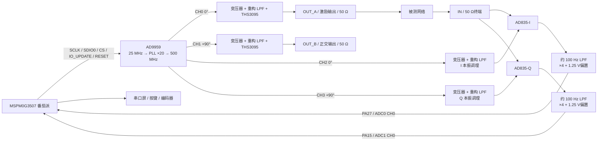

# AD9959 + AD835 + MSPM0G3507 初步设计规格

> 项目：2013 年全国大学生电子设计竞赛 E 题《简易频率特性测试仪》  
> 设计阶段：方案冻结前的初步设计（D0）  
> 当前边界：只定义硬件、接口、软件架构、算法和验证方法；不包含原理图、PCB、CCS 业务代码或可生产 BOM。

## 1. 设计结论

本方案可行，建议采用以下主链路：

- AD9959 同步产生四路同频信号：两路作为外部正交扫频输出，两路作为内部 I/Q 解调本振。
- 两片 AD835 对被测网络输出做零中频正交解调，得到直流附近的 I/Q 分量。
- 基带经过约 100 Hz 低通、4 倍增益和 1.25 V 电平平移后，送入 MSPM0G3507 的 ADC0 与 ADC1。
- MSPM0G3507 用同一计时器事件同步触发两路 ADC，并通过 DMA 成对采样。
- 每个频点使用“偏置 + 0°直通 + 90°直通”建立二维校准矩阵，再计算幅度、相位、峰值和 -3 dB 点。

该分工比让外部输出与内部本振共用同一模拟节点更稳健：外接 50 Ω负载、线缆和被测网络不会改变 AD835 的本振幅度。

## 2. 设计目标与边界

### 2.1 目标指标

| 项目 | 初步设计目标 |
| --- | --- |
| 扫频范围 | 1 MHz～40 MHz |
| 最小频率步进 | 100 kHz |
| 频点数量 | 391 点 |
| 外部正交输出 | OUT_A：0°，OUT_B：+90° |
| 外部输出幅度 | 50 Ω负载下 1.00 Vpp，设计目标误差不超过 ±3% |
| 两输出幅度平衡 | 校准后不超过 3%，留出题目 5%裕量 |
| 两输出相位差 | 校准后 90°±2°，留出题目 ±5°裕量 |
| 测量端口 | 50 Ω单端输入 |
| 幅度测量目标 | 1 MHz～40 MHz 内误差不超过 0.5 dB |
| 相位测量目标 | 1 MHz～40 MHz 内误差不超过 5° |
| 连续源扫频 | 391 点不超过 2 s，单点目标约 4 ms |
| 完整测量扫频 | 目标 10 s以内，必须小于 30 s |

以上是设计目标，不代表未经样机、校准和温漂测试即可保证的实测指标。

### 2.2 本阶段不做的内容

- 不修改现有 CCS 空工程。
- 不编写 AD9959、ADC、DMA、显示或算法代码。
- 不绘制正式原理图和 PCB。
- 不冻结 LC 滤波器、射频变压器和电源芯片的最终型号。
- 不生成生产文件或采购清单。

## 3. 总体架构

### 3.1 AD9959 通道分配

| 通道 | 相位基准 | 用途 | 输出链路 |
| --- | ---: | --- | --- |
| CH0 | 0° | OUT_A、被测网络激励 | 完整 50 Ω输出放大链路 |
| CH1 | +90° | OUT_B、正交源第二路 | 与 CH0 相同的 50 Ω输出放大链路 |
| CH2 | 0° + 校准修正 | AD835-I 本振 | 内部低功率本振链路 |
| CH3 | +90° + 校准修正 | AD835-Q 本振 | 与 CH2 相同的内部本振链路 |

四个通道必须在寄存器写入完成后共用一次 `IO_UPDATE`，使换频和相位变更同时生效。

## 4. 测量原理与电平预算

### 4.1 正交解调关系

设被测端输入 AD835 的信号为：

`x(t) = A_x cos(ωt + φ)`

I、Q 本振分别为：

`y_I(t) = A_y cos(ωt)`  
`y_Q(t) = A_y cos(ωt + 90°)`

AD835 的基本关系是：

`W = (X1 - X2)(Y1 - Y2) / U + Z`

其中标称比例因子 `U ≈ 1.05 V`。Z 接模拟地并经过低通后：

`I_DC = A_x A_y cos(φ) / (2U)`  
`Q_DC = A_x A_y sin(φ) / (2U)`

理想情况下：

`|H| ∝ sqrt(I² + Q²)`  
`φ = atan2(Q, I)`

实际系统不直接依赖标称 U，而由逐频点校准矩阵消除两片 AD835 的比例因子、失调、增益差、正交误差和固定路径相移。

### 4.2 建议电平

| 节点 | 目标电平 | 说明 |
| --- | ---: | --- |
| OUT_A、OUT_B | 1.00 Vpp / 50 Ω | 相当于约 +4 dBm |
| AD835 X 输入 | 典型 1.0 Vpp，峰值 0.5 V | 低于 ±1 V额定满量程 |
| AD835 Y 输入 | 目标 0.8～1.0 Vpp | 保留线性裕量 |
| AD835 直流矢量幅度 | 约 0.05～0.12 V | 取决于本振实际幅度和 U |
| 基带放大后 | 以 1.25 V为中心，约 ±0.2～±0.5 V | 正常范围约 0.75～1.75 V |
| ADC 有效范围 | 0～2.5 V | 采用 2.5 V参考 |

按 `A_x = A_y = 0.5 V峰值`、`U = 1 V`估算，I/Q 矢量的最大直流幅度约为 0.125 V；放大 4 倍后约为 0.5 V，正好落在 ADC 的中间区域。

## 5. 硬件初步设计

### 5.1 板卡划分

建议分为三部分：

1. 番茄派 MSPM0G3507：控制、ADC、DMA、运算和人机交互。
2. DDS/射频源板：AD9959、参考时钟、四路 DAC 输出网络、两路 THS3095 和 OUT_A/OUT_B。
3. 解调/基带板：50 Ω输入、两片 AD835、低通、电平平移、ADC 输出和模拟电源。

调试期可使用仓库中的 AD9959 模块代替 DDS/射频源板，但正式满足原题时应自制 DDS PCB，并按题目要求在覆铜层加入“2013”字样。

### 5.2 AD9959 核心与时钟

初始设计值：

- 参考时钟：25 MHz 晶体或低抖动振荡器。
- 内部 PLL：×20，系统时钟 500 MHz。
- 工作模式：四通道单音模式，不使用自动线性扫频累加器完成测量；由 MCU 明确控制每个频点。
- `RSET`：1.91 kΩ，得到约 10 mA满量程 DAC 电流；该电流是官方数据手册推荐的最佳杂散性能工作点。
- AVDD、DVDD：1.8 V±5%。
- DVDD_IO：3.3 V±5%。
- `CLK_MODE_SEL` 是 1.8 V模拟逻辑输入，不允许直接接 3.3 V。
- 未使用的 SDIO1～SDIO3、Profile 和功耗控制引脚必须按数据手册固定到确定电平，不能悬空。

25 MHz 晶体方案应保留外部时钟注入的焊盘或 SMA 选配位，方便排查 PLL、相噪和晶体起振问题。上电后先保持输出幅度为零，等待 PLL 锁定至少 10 ms，再开放射频输出。

### 5.3 四路 DAC 输出与重构滤波

AD9959 是互补电流输出 DAC，不能按普通电压输出直接使用。每路采用：

`IOUT/IOUTB → 1:1 中心抽头 RF 变压器 → 50 Ω端接 → 低通重构滤波器`

要求：

- DAC 输出必须按官方要求参考到 AVDD，不能把互补电流输出直接对地终端。
- 变压器候选可从 ADT1-1WT 同等级器件开始评估，但最终型号需依据 1～40 MHz插损、相位一致性和可采购性冻结。
- 四路重构滤波器采用完全相同的拓扑和封装。
- 初始仿真目标为 5 阶或 7 阶 50 Ω LC 低通：通带 1～40 MHz，通带纹波不超过 0.2 dB，截止频率约 60～80 MHz。
- 不在初步设计阶段直接照抄评估板的 200 MHz滤波器；其目标频带与本题不同。
- 每路保留 0 Ω旁路、π型匹配和探测点，便于分别测量变压器、滤波器和后级。

LC 数值必须经过阻抗仿真和样板实测后冻结，元件寄生、变压器漏感及 PCB 焊盘必须进入模型。

### 5.4 OUT_A / OUT_B 宽带输出

CH0、CH1 使用两套相同的 THS3095 非反相输出级：

- 供电：±5 V。
- 初始闭环增益：5 V/V。
- 初始反馈值：`RF = 1.00 kΩ`、`RG = 249 Ω`，与 TI 在 ±5 V、增益 5 下的推荐值一致。
- 输出串联：49.9 Ω后接 SMA；接 50 Ω负载时，负载端幅度约为放大器空载幅度的一半。
- 输出目标：放大器侧约 2.00 Vpp，50 Ω端口约 1.00 Vpp。
- 输入和输出均保留隔直电容，额定电压和自谐振频率需覆盖本频段。
- AD9959 的 10 位幅度字按频率查表补偿 OUT_A、OUT_B 的幅度平坦度和通道一致性。
- THS3095 的 PowerPAD 必须连接到大面积地和散热过孔；电源脚就近放置 100 nF与数微法并联去耦。

最终必须在 1 MHz、20 MHz、40 MHz分别验证 50 Ω负载下的幅度、失真、直流偏置、振铃和温升。

### 5.5 内部 I/Q 本振

CH2、CH3 不接外部端口，只驱动 AD835 的 Y 输入：

- 两路使用相同变压器、滤波器、端接和布线长度。
- 目标为 AD835 Y 差分输入 0.8～1.0 Vpp。
- 初版同时预留“直接驱动”和“增益 2 宽带缓冲”两种 0 Ω选配路径。
- 如果直接驱动幅度、平坦度和隔离度合格，缓冲器不装；否则再冻结缓冲器型号。
- CH2、CH3 的相位字和幅度字允许按频率分别修正。

这样可以在不更改 PCB 的情况下处理 AD9959 模块、变压器和滤波器造成的本振电平不足。

### 5.6 50 Ω测量输入与分配

测量输入链路：

`IN SMA → ESD 选配位 → 隔直电容 → 49.9 Ω终端 → 对称分配到两片 AD835 X1`

要求：

- 只放置一个 49.9 Ω终端，不能给两个 AD835 各放一个 50 Ω造成 25 Ω负载。
- 两片 AD835 的 X1 输入各串 22～33 Ω隔离电阻，支路尽量短且等长。
- 两片 AD835 的 X2 均在芯片附近接模拟地。
- AD835 输入约为 `100 kΩ || 2 pF`；两片并联造成的电容负载需要纳入 40 MHz相位仿真。
- 射频限幅二极管先作为 DNP 选配，避免其结电容破坏相位；过载保护是否装配由实测决定。

### 5.7 AD835 解调器

两片 AD835 连接相同，仅 Y1 的本振来源不同：

| 引脚 | 连接 |
| --- | --- |
| 1 / Y1 | CH2（I）或 CH3（Q）本振 |
| 2 / Y2 | 模拟地，走线与 Y1 回流对称 |
| 3 / VN | -5 V |
| 4 / Z | 模拟地；预留比例因子微调网络但初版不装 |
| 5 / W | 送基带低通 |
| 6 / VP | +5 V |
| 7 / X2 | 模拟地 |
| 8 / X1 | 50 Ω输入分配支路 |

去耦按每片、每条电源独立配置，至少包含 100 nF陶瓷和 4.7 µF低 ESR电容。两个 AD835 靠近放置，X、Y、W 路径按镜像方式布线。

### 5.8 基带低通、电平平移与 ADC 驱动

每路基带初始采用一阶无源低通：

- `R = 15.8 kΩ`
- `C = 100 nF`
- `fc ≈ 1 / (2πRC) ≈ 100.7 Hz`
- 时间常数约 1.58 ms，稳定到 0.1%约需 11 ms。

最低输入频率 1 MHz产生的乘积高频项为 2 MHz；100 Hz一阶低通对其理论衰减已超过 80 dB，因此初版不采用会显著延长建立时间的 1 Hz低通。

低通后使用 OPA2320 完成 4 倍增益和 1.25 V平移：

`V_ADC ≈ 1.25 V + 4.02 × V_BB`

实现建议：

- 一片 OPA2320 的两个通道分别处理 I 和 Q。
- 另一片 OPA2320 的一个通道缓冲 1.25 V中点，另一个通道按稳定的闲置方式连接并预留测试用途。
- 比例电阻采用 0.1%匹配网络：反相端 10.0 kΩ接地、40.2 kΩ反馈；同相端由 VBB 经 10.0 kΩ、由 1.25 V中点经 40.2 kΩ共同驱动，得到约 4.02 倍增益。实际比例因子纳入校准。
- OPA2320 使用番茄派同源的 3.3 V供电，输出天然限制在 MCU 电源范围内。
- 每个 ADC 前放置 100 Ω串联电阻和 1 nF电容，形成采样电荷库并隔离运放的容性负载。
- ADC 输入再预留低漏电肖特基钳位到 GND和 3.3 V；正常工作电压仍必须控制在 0～2.5 V。

### 5.9 ADC 参考与番茄派接线

采用 MSPM0G3507 内部 2.5 V VREF。番茄派原理图没有在 VREF+ 节点放置专用 1 µF电容，因此外部接口板必须补充：

- `PA23 / VREF+` 到 GND：1.0 µF、X7R、0805 或更小、±20%。
- 只有该电容实际连接后，软件才允许使能内部 VREF。
- 2.5 V参考经 20 kΩ/20 kΩ分压和 OPA2320 缓冲，产生 1.25 V中点。

番茄派 v1.1 的初步引脚冻结如下：

| 功能 | MSPM0G3507 | 番茄派接口 | 备注 |
| --- | --- | --- | --- |
| DDS_SCLK | PA7 | H1-8 | 沿用本地 AD9959 例程 |
| DDS_SDIO0 | PB2 | H1-9 | 单线写模式 |
| DDS_CS | PB3 | H1-10 | 低有效 |
| DDS_UPDATE | PA8 | H1-11 | 四通道统一更新 |
| DDS_RESET | PA9 | H1-12 | 主复位 |
| ADC_I | PA27 / A0_0 | H2-3 | ADC0 通道 0 |
| ADC_Q | PA15 / A1_0 | H2-16 | ADC1 通道 0；DAC 输出必须关闭 |
| VREF+ | PA23 / VREF+ | H2-7 | 外接 1 µF到 GND |
| 模拟地 | GND | H2-2 或 H2-20 | 与 I/Q/VREF相邻回流 |
| 串口屏 TX | PB17 / UART2_TX | H4 | 可选人机界面 |
| 串口屏 RX | PB18 / UART2_RX | H4 | 可选人机界面 |

本地番茄派原理图和 AD9959 例程已经核对：上述 DDS 五个 GPIO 与现有例程一致；PA27 与 PA15 分别是 ADC0/ADC1 的同编号通道，可用同一事件同步采样。

### 5.10 人机界面资源

优先复用番茄派板载资源，不再占用射频控制和 ADC 引脚：

- 五向按键：PB6、PB7、PB8、PB9、PB14。
- 旋转编码器：PB15、PB16，按压 PA12。
- 串口屏：PB17/PB18 的 UART2。
- RGB LED：PA2、PA3、PA4，用于电源、校准、扫频和故障状态。

## 6. 电源与接地设计

### 6.1 电源树

射频/模拟板不得直接依赖番茄派小型 LDO承担全部负载。建议从独立 9～12 V输入生成：

| 电源 | 最低设计能力 | 主要负载 |
| --- | ---: | --- |
| +5VA | 150 mA | 两片 AD835、两片 THS3095正电源及裕量 |
| -5VA | 150 mA | 两片 AD835、两片 THS3095负电源及裕量 |
| +1.8VA | 250 mA | AD9959 AVDD |
| +1.8VD | 200 mA | AD9959 DVDD |
| +3.3VD | 100 mA | AD9959 DVDD_IO、逻辑与辅助电路 |
| +3.3V_MCU | 番茄派本地供电 | MSPM0、基带 OPA2320、显示接口 |

AD9959 四通道单音模式总功耗典型约 540 mW、最大约 635 mW，电源和散热必须按最大值留裕量。AVDD 与 DVDD优先使用独立低噪声 LDO；若共用前级，至少通过磁珠和独立去耦分区。

### 6.2 上下电顺序

1. 建立 ±5 V、1.8 V和 3.3 V电源。
2. 保持 AD9959 `MASTER_RESET`有效，所有输出幅度字为零。
3. MCU 完成 GPIO、安全电平和 VREF初始化。
4. 释放 AD9959 复位，写入 PLL 与通道配置。
5. 等待至少 10 ms，再分批开放 CH2/CH3 本振和 CH0/CH1 输出。
6. 下电前先将四路幅度置零，再关闭模拟电源。

GPIO 串联 22～47 Ω抑制边沿振铃，并防止不同电源域上电顺序造成过大灌电流。

### 6.3 接地与 PCB

- 采用 4 层板：L1 器件/RF，L2完整地平面，L3电源/慢速信号，L4数字和辅助信号。
- 不切割地平面；通过器件分区和回流路径控制模拟、数字噪声。
- 所有 SMA 使用 50 Ω共面波导或微带，实际线宽由板厂叠层计算。
- 四路 DDS DAC 网络对称，CH0/CH1 输出链路对称，CH2/CH3 本振链路对称。
- 两片 AD835 镜像布局；两路 W 到低通、运放、ADC 接口等长且同环境。
- 参考时钟、SCLK 和 IO_UPDATE 远离 50 Ω输入与 AD835 W 输出。
- RF 路径避免长支路、测试夹和杜邦线；调试使用 SMA、U.FL或短同轴。
- 电源入口、每个 IC 和每个电源域均配置本地去耦；高速去耦电容的回路面积最小化。

## 7. 软件架构设计

### 7.1 分层

未来 CCS 工程建议采用以下逻辑分层，但本阶段不创建代码文件：

| 层 | 职责 |
| --- | --- |
| BSP | 番茄派引脚、时钟、定时器、UART、按键和 LED |
| Driver | AD9959 寄存器、双 ADC、DMA、Flash、显示通信 |
| Service | 扫频计划、采集、校准、I/Q数学、结果管理 |
| Application | 状态机、菜单、测量任务、故障处理 |

### 7.2 AD9959 驱动接口设计

现有本地驱动可作为寄存器读写参考，但测量程序需要增加“暂存后统一更新”的抽象：

1. 选择通道并写入 CH0～CH3 的频率字、相位字和幅度字。
2. 写寄存器期间不触发 `IO_UPDATE`。
3. 四通道全部准备完成后，只产生一次 `IO_UPDATE`脉冲。
4. 等待模拟链路建立，再启动 ADC采集。

驱动层未来至少需要以下逻辑接口：初始化、复位、暂存单通道参数、四通道提交、输出静音、自检点频和错误状态。接口名称可在编码阶段确定。

频率字和相位字：

`FTW = round(f_out × 2^32 / 500 MHz)`  
`POW = round(phase_deg × 2^14 / 360°)`

### 7.3 双 ADC 与 DMA

建议配置：

- ADC0：PA27 / A0_0，采 I。
- ADC1：PA15 / A1_0，采 Q。
- 参考：内部 2.5 V。
- 分辨率：12 位。
- 外部输出采样率：20 kSPS/通道。
- 硬件平均：初始 16 次；ADC 内部转换速率约 320 kSPS/通道。
- 每频点 DMA结果：128 对 I/Q样本，采集窗口约 6.4 ms。
- 同一计时器事件同时触发 ADC0 与 ADC1，禁止由软件先后启动。

DMA 使用成对或双缓冲区；CPU 只在块完成后读取均值、极差、饱和计数和方差，避免中断逐样本处理。

### 7.4 单点测量时序

| 阶段 | 初始时间 |
| --- | ---: |
| 暂存四通道参数并统一 IO_UPDATE | 小于 0.2 ms |
| 模拟低通建立 | 12 ms |
| 双 ADC 同步 DMA采集 128 对 | 6.4 ms |
| 均值、校准、幅相计算 | 小于 1 ms目标 |
| 单点合计 | 约 20 ms |

391 点理论约 7.8 s；加入界面刷新和调度裕量，完整测量目标控制在 10 s内。

连续正交信号源扫频模式不做 ADC采集，每点目标约 4 ms，391 点约 1.564 s，为寄存器写入和调度留下余量。

### 7.5 主状态机

| 状态 | 主要动作 |
| --- | --- |
| BOOT | 时钟、GPIO、安全输出、VREF和外设初始化 |
| SELF_TEST | 检查电源、ADC中点、DDS点频和数据有效性 |
| IDLE | 菜单、点频和参数编辑 |
| SOURCE_SWEEP | 2 s内的连续正交扫频输出 |
| POINT_SETUP | 设置四通道频率/相位/幅度并统一更新 |
| SETTLE | 等待基带低通建立 |
| ACQUIRE | 双 ADC + DMA采集 |
| CALCULATE | 去偏置、二维校准、幅相计算 |
| MEASURE_SWEEP | 依次完成 391 点并存储结果 |
| CALIBRATION | 偏置、0°和 90°逐频点校准 |
| DISPLAY | 绘图、游标、峰值和 -3 dB结果 |
| FAULT | 输出静音，显示饱和、掉电、校准或通信错误 |

采集期间不刷新整屏；显示任务只读取已完成的结果缓冲区，避免 UART阻塞影响点间时序。

## 8. 校准设计

### 8.1 校准步骤

使用同一根短 50 Ω同轴将 OUT_A 直接连接到 IN，预热后对每个频点执行：

1. **偏置采集**：CH0 激励幅度置零，CH2/CH3 本振保持正常，得到 `b = [bI, bQ]ᵀ`。
2. **0°基向量**：CH0 恢复标称幅度、相位 0°，得到 `v0 = raw0 - b`。
3. **90°基向量**：仅把 CH0 相位改为 +90°，物理线缆和输出链路不变，得到 `v90 = raw90 - b`。
4. 构造 `B = [v0  v90]` 并保存 `B⁻¹`。

测量时：

`h = B⁻¹ × (raw - b)`

然后：

`magnitude = sqrt(hI² + hQ²)`  
`magnitude_dB = 20 log10(magnitude)`  
`phase = atan2(hQ, hI)`

用 CH0 自身切换 0°/90°，可避免更换输出端口或线缆造成的附加相位误差。

### 8.2 校准数据

每频点保存：

- I/Q 偏置：2 个 `float32`。
- 2×2 逆矩阵：4 个 `float32`。
- 可选温度、校准幅度和有效标志。

仅偏置和矩阵为 `391 × 6 × 4 = 9384 B`。加上 CH0/CH1 幅度修正表、头部和 CRC，单份校准数据约 12 kB；使用 A/B 双槽仍可放入 MSPM0G3507 的 128 kB Flash。

校准记录应包含：魔数、格式版本、板卡版本、频率起点、步进、点数、系统时钟、时间戳、温度和 CRC32。只有全部字段与当前配置匹配时才允许加载。

### 8.3 运行时处理

- 幅值很小时冻结相位并显示“低于相位可信阈值”，避免 `atan2`噪声乱跳。
- 相位曲线按相邻点做 ±360°展开。
- -3 dB频率在相邻两个频点的 dB值间线性插值，不能只返回 100 kHz栅格点。
- 同时保存原始 I/Q均值和饱和计数，便于校准失效时追踪硬件问题。
- 初版可使用 `float32`；391 点计算量很小，MATHACL 的平方根和反正切只作为优化手段，不作为可行性的前提。

## 9. 自检与故障策略

开机自检：

1. 四路射频输出保持静音。
2. 检查 VREF启动完成，I/Q ADC应接近 1.25 V中点。
3. 开启 CH2/CH3 本振，检查偏置没有越界。
4. 设置 1 MHz低幅度点频，确认 ADC均值改变且没有饱和。
5. 检查校准记录版本和 CRC。

故障条件：

- ADC 小于 50 mV或大于 2.45 V：模拟链路越界。
- 连续样本饱和：输入过载或电平平移故障。
- I/Q 方差超过阈值：本振、供电、接地或连接异常。
- 校准矩阵行列式过小：I/Q 不正交、一路本振丢失或 ADC通道故障。
- 频点参数超范围：禁止提交 DDS并静音输出。

进入 FAULT 后必须先把 AD9959 四路幅度置零，再允许显示和串口报告错误。

## 10. 初步误差预算

| 误差源 | 幅度目标 | 相位目标 | 主要控制手段 |
| --- | ---: | ---: | --- |
| OUT_A/OUT_B 滤波和放大差异 | 0.15 dB | 1.0° | 对称布局、幅相查表 |
| CH2/CH3 本振差异 | 校准消除 | 1.0°残差 | 同器件、等长、二维校准 |
| 两片 AD835 差异 | 0.15 dB | 1.5° | 逐频点 2×2矩阵 |
| ADC增益、偏置和采样偏差 | 0.10 dB | 0.8° | 同步触发、均值、偏置校准 |
| 50 Ω端接、线缆和连接器 | 0.15 dB | 1.5° | 直通校准、SMA、短同轴 |
| 温漂和重复性 | 0.10 dB | 1.5° | 预热、温度记录、重校准 |
| 综合设计目标 | 不超过 0.5 dB | 不超过 5° | 以样机实测关闭误差预算 |

40 MHz时 1 ns延时对应 14.4°相位，因此即使有逐频点校准，RF 布局仍必须保持对称和稳定。

## 11. 验证计划与设计关口

### D1：模块级验证

- 用现有 AD9959 模块验证 1、20、40 MHz四通道同步点频。
- 验证统一 IO_UPDATE 后通道间相位稳定。
- 测量 CH2/CH3 经变压器和滤波后能否达到 0.8～1.0 Vpp。
- 单独验证一个 AD835 的乘积直流、100 Hz低通建立时间和失调。

### D2：原理图冻结前仿真

- 四路 DAC 变压器和 50 Ω重构滤波器 S 参数/AC仿真。
- THS3095 在增益 5、等效 100 Ω负载下的稳定性和幅度。
- 两片 AD835 并联输入电容对 50 Ω端口的回波损耗和相位影响。
- 基带 `1.25 V + 4×VBB` 全容差和钳位仿真。
- ±5 V、1.8 V和 3.3 V电源纹波及启动顺序检查。

### D3：首板验收

| 测试 | 通过条件 |
| --- | --- |
| OUT_A、OUT_B 点频 | 1/20/40 MHz，50 Ω下均不低于 1 Vpp |
| 正交输出 | 三个测试频点相位差 90°±5°、幅度差不超过 5% |
| 连续源扫频 | 391 点不超过 2 s |
| 输入匹配 | 1～40 MHz回波损耗目标优于 15 dB |
| 基带中点 | 无信号时 I/Q均为 1.25 V附近且不饱和 |
| 双 ADC同步性 | 同一事件触发，无软件启动偏差 |
| 直通测量 | 校准后 1～40 MHz幅度接近 0 dB、相位接近 0° |
| 已知衰减/移相网络 | 幅度误差不超过 0.5 dB、相位误差不超过 5° |
| 完整测量 | 391 点不超过 30 s，设计目标不超过 10 s |

## 12. 首版 BOM 功能清单

| 功能 | 候选器件/数量 | 冻结条件 |
| --- | --- | --- |
| 四通道 DDS | AD9959 ×1 | 固定 |
| 正交解调 | AD835 ×2 | 固定 |
| 主控/采集 | MSPM0G3507 番茄派 ×1 | 固定 |
| 50 Ω输出放大 | THS3095 ×2 | 40 MHz、1 Vpp、温升和稳定性实测 |
| 基带运放 | OPA2320 ×2 | 3.3 V、ADC驱动和偏置误差实测 |
| DDS 输出变压器 | 1:1 中心抽头 RF 变压器 ×4 | 1～40 MHz插损和相位一致性 |
| 重构滤波器 | 50 Ω LC ×4 | 仿真、样板和校准余量 |
| DDS 参考 | 25 MHz晶体/振荡器 ×1 | 起振、PLL和相位噪声 |
| RF 接口 | SMA：OUT_A、OUT_B、IN | 固定 |
| 模拟电源 | ±5 V、1.8VA、1.8VD、3.3 V | 纹波、负载和热设计 |

## 13. 当前必须保留的未决项

1. CH2/CH3 直接驱动 AD835 是否能在 1～40 MHz保持 0.8 Vpp以上；PCB 必须保留缓冲器选配位。
2. 四路 LC 低通的具体阶数和值；必须完成含变压器和焊盘寄生的仿真。
3. THS3095 前级实际输入幅度和 ACR补偿范围；样机前不能假定固定增益一定得到 1 Vpp。
4. ±5 V和 1.8 V电源的具体拓扑；根据总功耗、纹波和体积再冻结。
5. 最终显示屏型号和通信协议；不影响射频和采集架构。
6. 是否加入自动射频校准开关；初版采用手动短同轴直通，降低射频开关引入的误差。

## 14. 设计依据

### 官方资料

- [AD9959 数据手册（Analog Devices）](https://www.analog.com/media/en/technical-documentation/data-sheets/AD9959.pdf)
- [AD9959 评估板与官方原理图（Analog Devices）](https://www.analog.com/en/resources/evaluation-hardware-and-software/evaluation-boards-kits/eval-ad9959.html)
- [AD835 数据手册（Analog Devices）](https://www.analog.com/media/en/technical-documentation/data-sheets/ad835.pdf)
- [MSPM0G3507 数据手册（Texas Instruments）](https://www.ti.com/lit/ds/symlink/mspm0g3507.pdf)
- [MSPM0 G 系列硬件开发指南（Texas Instruments）](https://www.ti.com/lit/an/slaae76e/slaae76e.pdf)
- [THS3095 数据手册（Texas Instruments）](https://www.ti.com/lit/ds/symlink/ths3095.pdf)
- [OPA2320 数据手册（Texas Instruments）](https://www.ti.com/lit/ds/symlink/opa2320.pdf)

### 仓库内依据

- `培训资料/SCH_MSPM0G3507番茄派_v1.1_2026-05-09.pdf`
- `AD9959-DDS信号源资料/番茄派例程-MSPM0G3507_AD9959-学长培训/`
- `AD9959-DDS信号源资料/开源参考-veis-lzf-DDS-AD9959/Hardware/Reference Document/ad9958-ad9959-schematic.pdf`
- `联网调研与推荐方案.md`

---

下一设计阶段应先完成 D1 模块级电平验证和 D2 仿真，再绘制正式原理图。当前文档已经足够用于原理图模块划分、接口冻结和软件任务拆分，但其中标记为“候选”“初始值”或“未决”的项目不得直接当作生产参数。
